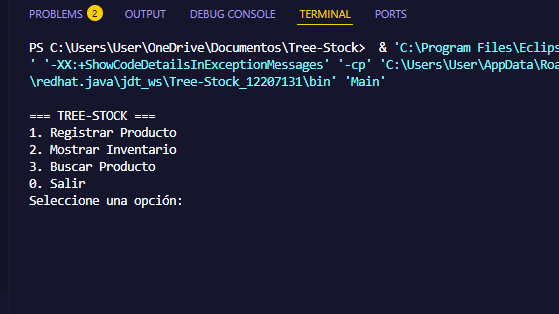
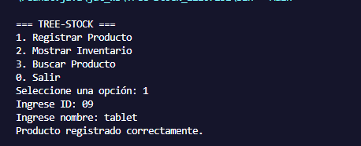
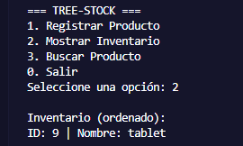

# 🌳 Tree-Stock - Sistema de Inventario con Árbol Binario

## 📌 Objetivo

Desarrollar una aplicación de consola en Java que permita gestionar un inventario de productos utilizando un **árbol binario de búsqueda (BST)**, donde cada producto se almacena según su ID de forma ordenada.

---

## ⚙️ Tecnologías utilizadas

* Java (JDK Eclipse Temurin)
* Visual Studio Code
* Git y GitHub

---

## 🚀 Instrucciones de ejecución

1. Clonar o descargar el repositorio
2. Abrir el proyecto en VS Code
3. Compilar el programa:

   ```bash
   javac Main.java
   ```
4. Ejecutar el programa:

   ```bash
   java Main
   ```

---

## 📋 Funcionalidades del sistema

### 1. Registrar Producto

Permite ingresar un ID y un nombre.
El producto se inserta en el árbol respetando la estructura del BST:

* Menores a la izquierda
* Mayores a la derecha

### 2. Mostrar Inventario

Se utiliza un recorrido **Inorden**, lo que permite mostrar los productos ordenados automáticamente por ID.

### 3. Buscar Producto

Busca un producto por su ID utilizando recursividad:

* Si existe, muestra su nombre
* Si no existe, indica que no fue encontrado

---

## 🧠 Estructura del proyecto

* `Producto.java` → Representa el nodo del árbol (datos + punteros)
* `ArbolInventario.java` → Contiene la lógica del árbol (insertar, buscar, recorrer)
* `Main.java` → Menú interactivo con el usuario

---

## 🌲 Lógica del árbol binario

Cada nodo contiene:

* ID
* Nombre
* Referencia al hijo izquierdo
* Referencia al hijo derecho

El árbol se organiza así:

* ID menor → izquierda
* ID mayor → derecha

Esto permite:
✔ Búsqueda rápida
✔ Inserción eficiente
✔ Orden automático con Inorden

---

## 📸 Evidencias de ejecución

### 🖥️ Menú principal



### ➕ Registro de producto



### 🔍 Búsqueda de producto


### 📊 Inventario ordenado



---

## 🎥 Video de sustentación


---

## 🧪 Ejemplo de uso

1. Registrar productos:

   * ID: 10 → Producto A
   * ID: 5 → Producto B
   * ID: 20 → Producto C

2. Mostrar inventario:

   * 5 → Producto B
   * 10 → Producto A
   * 20 → Producto C

---

## 👨‍💻 Autor(es)

* Valeria Fernández Vergara


---

## 🔗 Repositorio

https://github.com/Valeriafer10/Tree-Stock.git
